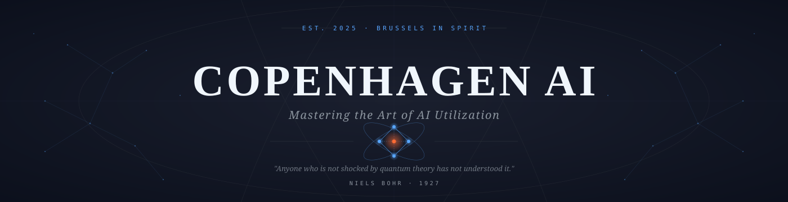
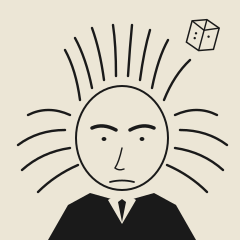
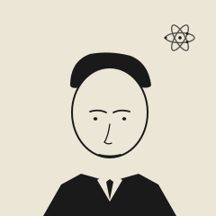
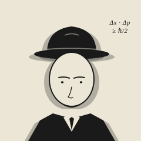

<div align="center">



<br/>

<sub><i>Conference No. 1 &nbsp;·&nbsp; Electrons and Photons, redux.</i></sub>

</div>

<br/>

---

## ⚛️ The Copenhagen Interpretation

> _"관측이 일어나기 전까지, 가능성은 가능성으로만 존재한다."_

1927년 10월, 브뤼셀.   
보어, 아인슈타인, 하이젠베르크, 슈뢰딩거. 
29명의 물리학자가 세계의 작동 원리를 다시 쓰기 위해서가 아니라,   
더 정확한 질문을 던지기 위해서 한자리에 모였다.

같은 호텔 식당에서 보어와 아인슈타인은 매일 아침 논쟁했고,  
그 결과 코펜하겐 해석 — _관측 이전에는 상태가 없다_ — 이 정립되었다.

100년이 지나, 우리는 또 다른 경계에 서 있다.  
AI는 도구를 넘어 **공동 창작자**가 되어가고 있고,  
그 활용의 정점이 무엇인지는 아직 누구도 모른다.

**Copenhagen AI는 그 답을 찾으려 하지 않는다.**
대신, 매주 한 번 모여 _가능성을 관측한다._

코드를 짠다. 부서뜨린다. 다시 짠다.
파동함수가 붕괴하듯, **이론은 실행에서 비로소 형태를 갖는다.**

<br/>

---

## 🔬 The Weekly Session

매주, 4명의 엔지니어가 자신만의 솔베이 회의를 연다.
슬라이드 없음. 어젠다 데크 없음.
오직 **실험, 실패, 그리고 가끔의 돌파구.**

<table>
  <tr>
    <td width="120" align="center">🧪<br/><b>Build</b></td>
    <td>한 주 동안 AI와 함께 무언가를 만들고 출시한다. 작동하는 코드, 살아있는 문서, 굴러가는 자동화.</td>
  </tr>
  <tr>
    <td align="center">⚡<br/><b>Present</b></td>
    <td>10분 데모. 무엇이 작동했고, 무엇이 무너졌는지. 세련된 발표는 금지된다.</td>
  </tr>
  <tr>
    <td align="center">🌊<br/><b>Challenge</b></td>
    <td>서로의 전제를 박살낸다. 보어가 아인슈타인을 도발하듯, 우리도 서로를 흔든다.</td>
  </tr>
  <tr>
    <td align="center">📐<br/><b>Synthesize</b></td>
    <td>오직 단 하나의 통찰을 합의로 남긴다. 나머지는 기록으로만 남고, 다음 주에 다시 검증된다.</td>
  </tr>
</table>

> 솔베이 회의가 그러했듯, **틀려도 기록은 남는다.**

<br/>

---

## 👥 The Conference

> _"이 사진 속 사람들 중 절반은 노벨상을 받았고, 나머지 절반은 받을 수 있었다."_

<table>
  <tr>
    <td align="center" width="25%">
      <a href="https://github.com/e9ua1">
        
      </a>
      <br/>
      <b>IQ</b>
      <br/>
      <code>@e9ua1</code>
      <br/>
      <sub><b><i>Einstein</i></b></sub>
      <br/>
      <sub>납득될 때까지 토 다는 사람</sub>
    </td>
    <td align="center" width="25%">
      <a href="https://github.com/Chocoding1">
        
      </a>
      <br/>
      <b>Chocoding1</b>
      <br/>
      <code>@Chocoding1</code>
      <br/>
      <sub><b><i>Bohr</i></b></sub>
      <br/>
      <sub>합의의 중심에서 흐름을 잡는 사람</sub>
    </td>
    <td align="center" width="25%">
      <a href="https://github.com/Jaeminjeong1">
        
      </a>
      <br/>
      <b>Jeong Jaemin</b>
      <br/>
      <code>@Jaeminjeong1</code>
      <br/>
      <sub><b><i>Heisenberg</i></b></sub>
      <br/>
      <sub>확정 짓기 전에 일단 부딪쳐보는 사람</sub>
    </td>
    <td align="center" width="25%">
      <a href="https://github.com/JohnPrk">
        
      </a>
      <br/>
      <b>박민욱</b>
      <br/>
      <code>@JohnPrk</code>
      <br/>
      <sub><b><i>Schrödinger</i></b></sub>
      <br/>
      <sub>상태를 동시에 여러 개 굴리는 사람</sub>
    </td>
  </tr>
</table>

<details>
<summary><b>📜 Solvay 1927 인물 소개</b></summary>
<br/>

| Physicist | Known For | Vibe |
|---|---|---|
| `Einstein` | 회의주의자 · "신은 주사위를 던지지 않는다" | _납득될 때까지 토 다는 사람_ |
| `Bohr` | 코펜하겐 학파의 수장 · 보어 모델 | _합의의 중심에서 흐름을 잡는 사람_ |
| `Heisenberg` | 불확정성 원리 | _확정 짓기 전에 일단 부딪쳐보는 사람_ |
| `Schrödinger` | 파동 방정식 · 고양이 사고실험 | _상태를 동시에 여러 개 굴리는 사람_ |

</details>

<br/>

---

## 🧪 Experiments

> 우리는 _Projects_ 라고 부르지 않는다. **Experiments.**
> 매주 새로운 가설을 세우고, 실행으로 검증하고, 결과를 공개한다.

| Experiment | Status | Hypothesis |
|---|---|---|
| _첫 실험을 기다리는 중_ | 🔵 _Superposition_ | _아직 관측되지 않음_ |

<sub>Status: 🔵 Superposition · 🟢 Live · 🟡 In Progress · 🔴 Collapsed</sub>

<br/>

---

## 📜 The Vibe Coding Manifesto

```
We don't just use AI.
We co-create with it.

바이브 코딩은 게으름이 아니다.
의도(intent)의 새로운 형식이다.

방향은 우리가 정한다.
무한한 반복 속도는 AI가 제공한다.
그렇게 만들어진 세계는, 여전히 우리의 것이다.

We don't memorize. We observe.
We don't predict. We collapse.
We don't ship answers. We ship questions sharper than yesterday.
```

<br/>

---

## 🌐 Beyond This Repository

<table>
  <tr>
    <td>📡 <b>Conference Log</b></td>
    <td><i>coming soon — 매주 세션의 기록이 여기에 쌓인다</i></td>
  </tr>
  <tr>
    <td>🌍 <b>GitHub Pages</b></td>
    <td><i>coming soon — copenhagen-ai.github.io</i></td>
  </tr>
  <tr>
    <td>📚 <b>Reading List</b></td>
    <td><i>coming soon — 우리가 함께 읽고 부서뜨리는 것들</i></td>
  </tr>
</table>

<br/>

---

<div align="center">

<sub>

`Built between observation and collapse.`

<br/>

⚛️

</sub>

</div>
